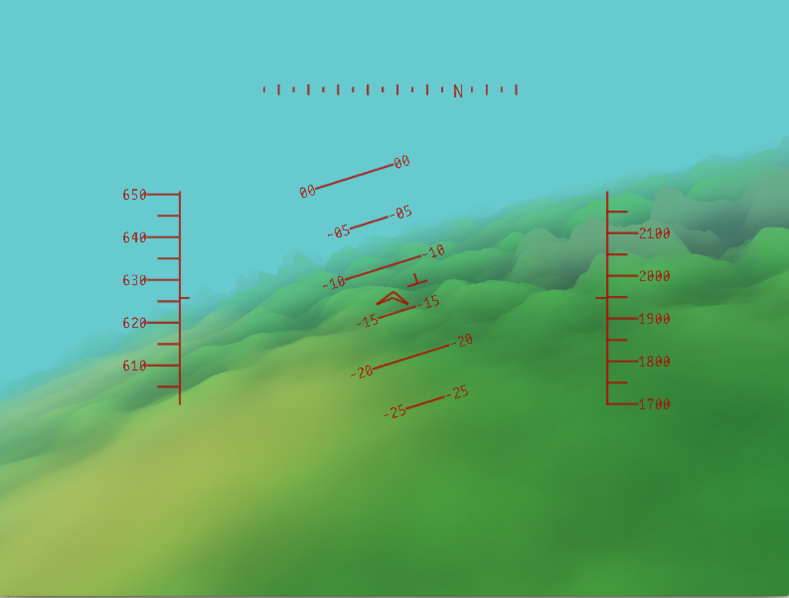

Flight Simulator with Tiva Launchpad Joystick
======

#### Dependencies
	
__C++ Side__

1. Boost:
	- Specifically `boost::asio`, for serial port stuffs
	- Download: http://www.boost.org/
	- Installation:
		- Boost is a header-only library... mostly. There are some libraries that must be built separately. 
		- Asio depends on only a few of these libraries that require building. 
		- Full instructions here: http://www.boost.org/doc/libs/1_59_0/doc/html/boost_asio/using.html
		- Building: 
			- Go into the boost distribution folder (looks something like `boost_1_59_0/`).
			- Run `bootstrap.sh`.
			- Run `b2 install --prefix=%BOOST_PATH%` where %BOOST_PATH% is the directory where you want Boost to be installed
			- If Windows, identify the compiler that you're using. For instance, Code::Blocks uses gcc 4.7.1 (tdm-1). See: http://www.boost.org/doc/libs/1_59_0/more/getting_started/unix-variants.html#identify-your-toolset
			- Run something like `b2 --with-system --with-thread --with-date_time --with-regex --with-serialization --build-type=complete toolset=gcc-4.7.1`, except replace gcc-4.7.1 with your version of the compiler. If this particular gcc.exe appears first in your `%PATH%` environmental variable, you don't really need to specify version (i.e. `toolset=gcc` would suffice), but it can't hurt to be specific.
			- Wait. Hopefully everything should complete without any errors.
			- After completion, you should find in %BOOST_PATH% an include and a lib folder.
	- Compiling (Code::Blocks):
		- Locate includes: Build options -> Search directories -> Compiler: Add `%BOOST_PATH%/include/boost-1_59` or something like that. There should be a `boost` folder in here.
		- Locate libraries: Build options -> Search directories -> Linker: Add `%BOOST_PATH%/lib`. There should be a bunch of `.a` files in this directory.
		- Link libraries: Build options -> Linker settings -> Add `libboost_system-mgw47-mt-1_59` and any other libraries that are needed. (Names might be something simpler, like `boost_system`. They need to match the filenames.) The order is important: Libs must come before any libs that they depend on.  
			- In Windows, you also have to link `wsock32` for asio to work.
		- Should be more or less the same with other IDEs.
		- With command line/makefile: 
			- `-I[path]` for include directories
			- `-L[path]` for library directories
			- `-l[name]` for linking specific libraries
2. GLUT:
	- OpenGL Utility Toolkit, for system-level I/O and rendering graphics
	- FreeGLUT offers the same functionality as GLUT. Might be better to install FreeGLUT if you don't already have GLUT.
	- Download: http://freeglut.sourceforge.net/index.php#download
	- Installation: 
		- A pain in Windows because you can't use just `make` to build everything.
		- Full instructions here: http://wiki.codeblocks.org/index.php?title=Using_FreeGlut_with_Code::Blocks
		- A method for CodeBlocks: (Following the instructions in README.cmake)
			- Go into the freeglut distribution folder (looks something like `freeglut-3.0.0`).
			- Download and install cmake: https://cmake.org/download/
			- Run cmake-gui.exe.
			- In the "Where is the source code" box, put the root directory of your freeglut source (so that's /freeglut, not /freeglut/src).
			- In the "Where to build the binaries" box, put the directory where you want freeglut to be installed.
			- Hit Configure and specify the generator for the project (e.g. "CodeBlocks - MinGW Makefiles"). Wait for it to finish.
			- Hit Generate and wait for it to finish.
			- If you chose Code::Blocks, there should be a `.cbp` file in the target directory now. Open that with CodeBlocks and build everything. Wait for it to finish.
			- There should now be a couple of `.a` files in the lib folder and a `.dll` file in the bin folder. 
			- Copy the .dll to `C:\Program Files (x86)\CodeBlocks\MinGW`. Should be named something like `freeglut.dll`. Probably don't even need this because I think we're going to link statically. Oh well, can't hurt.
			- Copy the .a files to `C:\Program Files (x86)\CodeBlocks\MinGW\lib`. Should be named something like `libfreeglut.a` and `libfreeglut.dll.a`.
			- Copy the include folder from the distribution folder to `C:\Program Files (x86)\CodeBlocks\MinGW\include`. There should be some `.h` files that go inside a `GL` folder.
	- Compiling (Code::Blocks):
		- Include directories: We put the includes in Code::Block's default include path, so we don't need to do anything.
		- Library directories: We put the libraries in Code::Block's default library search path, so we don't need to do anything.
		- Link libraries: If Windows, link: `freeglut`, `opengl32`, `glu32`, `winmm`, `gdi32`.
3. GLEW:
	- OpenGL Extension Wrangler Library, for cross-platform C++ extension loading
	- Download: http://glew.sourceforge.net/
	- Installation:
		- The Makefile doesn't work in Windows, so try this super hacky solution: https://bruceoutdoors.wordpress.com/2014/07/16/glew-for-mingw-in-windows/
		- cd to the distribution directory (should look something like `glew-1.13.0`) and execute these, line by line:
			- `mkdir lib`
			- `gcc -DGLEW_NO_GLU -O2 -Wall -W -Iinclude  -DGLEW_BUILD -o src/glew.o -c src/glew.c`
			- `gcc -shared -Wl,-soname,libglew32.dll -Wl,--out-implib,lib/libglew32.dll.a -o lib/glew32.dll src/glew.o -L/mingw/lib -lglu32 -lopengl32 -lgdi32 -luser32 -lkernel32`
			- `ar cr lib/libglew32.a src/glew.o`
			- `gcc -DGLEW_NO_GLU -DGLEW_MX -O2 -Wall -W -Iinclude  -DGLEW_BUILD -o src/glew.mx.o -c src/glew.c`
			- `gcc -shared -Wl,-soname,libglew32mx.dll -Wl,--out-implib,lib/libglew32mx.dll.a -o lib/glew32mx.dll src/glew.mx.o -L/mingw/lib -lglu32 -lopengl32 -lgdi32 -luser32 -lkernel32`
			- `ar cr lib/libglew32mx.a src/glew.mx.o`
		- There should now be `.a` and `.dll` files in the lib folder.
	- Compiling (Code::Blocks):
		- Include directories: `%GLEW_PATH%/include`
		- Library directories: `%GLEW_PATH%/lib`
		- Link libraries: Link `libglew32`
4. SFML 2.3.2:
	- C++ graphics
	- Download: http://www.sfml-dev.org/download/sfml/2.3.2/
	- Actually, it looks like we're not using this anymore. It's not included in any of the code.
	
__Launchpad Side__

1. Energia 16:
	- For Launchpad Tiva C TM4C123
	- Download: http://energia.nu/download/
	- Installation: Easy
2. Orbit Booster Pack:
	- For accelerometer and other stuff
	- Installation: Extract contents of zip file into `%ENERGIA_PATH%/Contents/Resources/Java/hardware/lm4f/libraries/OrbitBoosterPack`.
						
#### References
- TM4C123 guide: http://energia.nu/pin-maps/guide_tm4c123launchpad/
- ADXL345 data sheet: http://www.analog.com/media/en/technical-documentation/data-sheets/ADXL345.pdf
- ADXL345 angle maths: http://www.analog.com/media/en/technical-documentation/application-notes/AN-1057.pdf
- Boost and serial port: http://www.webalice.it/fede.tft/serial_port/serial_port.html
- Timeout serial reader: http://www.ridgesolutions.ie/index.php/2012/12/13/boost-c-read-from-serial-port-with-timeout-example
- Quaternions: https://en.wikipedia.org/wiki/Quaternion
- Quaternion rotation intuition: http://math.stackexchange.com/a/1434368/201000
- Tait-Bryan angles: https://en.wikipedia.org/wiki/Euler_angles#Tait.E2.80.93Bryan_angles
- Euler angles: https://en.wikipedia.org/wiki/Conversion_between_quaternions_and_Euler_angles
- Orientation, Rotation, Velocity and Acceleration, and the SRM: http://www.sedris.org/wg8home/Documents/WG80485.pdf

